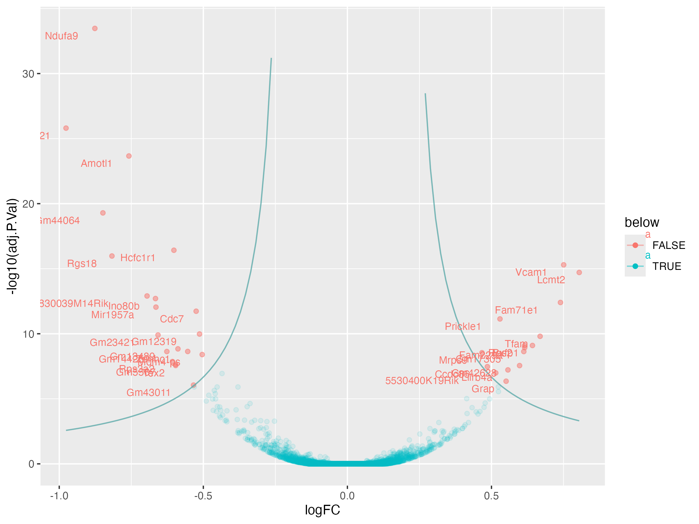

<p align="center">
  
</p>

VolcanoPlus Package: A Custom Volcano Plot Generator
====================================================

Introduction
------------

The `volcanoPlus` package allows you to create volcano plots with custom asymptotic thresholds and optional labeling of specific points. This tutorial will guide you through generating a volcano plot from a dataset, setting significance thresholds, and visualizing the result.

## Features

- **Custom Asymptotic Thresholding:** Define mirrored asymptotic functions to identify significant points based on log fold change and adjusted p-values.
- **Flexible Point Labeling:** Highlights and labels specific points (e.g., genes) based on user-defined criteria.
- **Enhanced Visualization:** Control the appearance of significant and non-significant points using alpha transparency, custom colors, and asymptotic curves.


Step 1: Install and Load the Package
------------------------------------

Before you start, make sure you have the `volcanoPlus` package installed. You can install it from GitHub or your local directory:

```r
# Install the devtools package if you haven't already
install.packages("devtools")

# Install volcanoPlus from GitHub
devtools::install_github("CharlieBarker/volcanoPlus")
```
Then load the necessary libraries:
```r
# Load the volcanoPlus package
library(volcanoPlus)
library(ghibli)
library(ggplot2)
```
Step 2: Download Example Data
-----------------------------

For demonstration purposes, we'll use a sample dataset. The following code will download and read an RDS file that contains the data:
```r
# Download the data we will use for plotting
download.file("https://raw.githubusercontent.com/biocorecrg/CRG_RIntroduction/master/de_df_for_volcano.rds",
              "de_df_for_volcano.rds", method="curl")

# The RDS format is used to save a single R object to a file, and to restore it.
# Extract that object in the current session:
tmp <- readRDS("de_df_for_volcano.rds")

# Remove rows that contain NA values
de <- tmp[complete.cases(tmp), ]

# Example Data (Replace this with actual data)
# For this example, we assume a data frame with `logFC`, `adj.P.Val`, and `Gene` columns.
data <- data.frame(
  logFC = de$log2FoldChange,
  adj.P.Val = de$pvalue,
  Gene = de$gene_symbol
)
```
Step 3: Set Significance Thresholds and Labeling Criteria
--------------------------------------------------------

You can define custom thresholds for significance (horizontal and vertical asymptotes) and labeling criteria:
```r
# Set significance thresholds for the volcano plot
significance_thresholds <- list(horizontal_asymptote = 2, vertical_asymptote = 0.2)

# Optional: Set parameters for labeling specific points
labeling_criteria <- list(horizontal_asymptote = 2, vertical_asymptote = 0.2)
```

Step 4: Generate the Volcano Plot
---------------------------------

Now, you can create the volcano plot with the `plot_volcano_plus` function:

```r
# Create the volcano plot
volcano_plot <- plot_volcano_plus(data,
                                  title = "",
                                  significance_thresholds = significance_thresholds,
                                  labeling_criteria = labeling_criteria)

# Show the volcano plot
print(volcano_plot  +
        geom_vline(xintercept = 0, linetype = 'dotted', color = 'darkred') +  # Vertical line at x = 0
        xlab("Log fold change") + ylab("Log10(Adjusted P value)") +
        theme_minimal() +  # Minimal theme (no extra packages)
        theme(legend.position = "none"))
```

Step 5: Saving the Plot to PNG
------------------------------

If you want to save the plot to a PNG file, use the following code:

```r
ggsave("volcano_plot.png", plot = volcano_plot, width = 8, height = 6, dpi = 300)
```
The volcano plot is now saved as `volcano_plot.png` in your working directory.

Example Output
--------------

Here's an example of the resulting volcano plot:

output :
<p align="center">
  
</p>
This plot shows the log fold change on the x-axis and the -log10 adjusted p-value on the y-axis. Points that fall below the asymptotic threshold are considered insignificant and are plotted with reduced transparency.
---

Notes:
------

- The threshold parameters (`horizontal_asymptote` and `vertical_asymptote`) can be adjusted according to your dataset to highlight the most relevant points.
- The `plot_volcano_plus` function allows you to customize the plot, including the color of significant points and the inclusion of gene labels.
